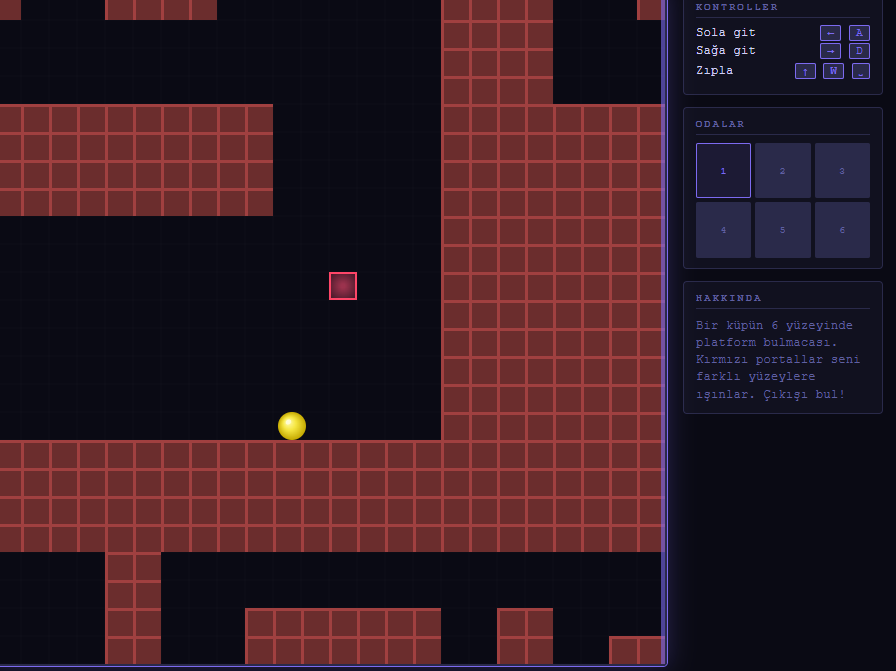
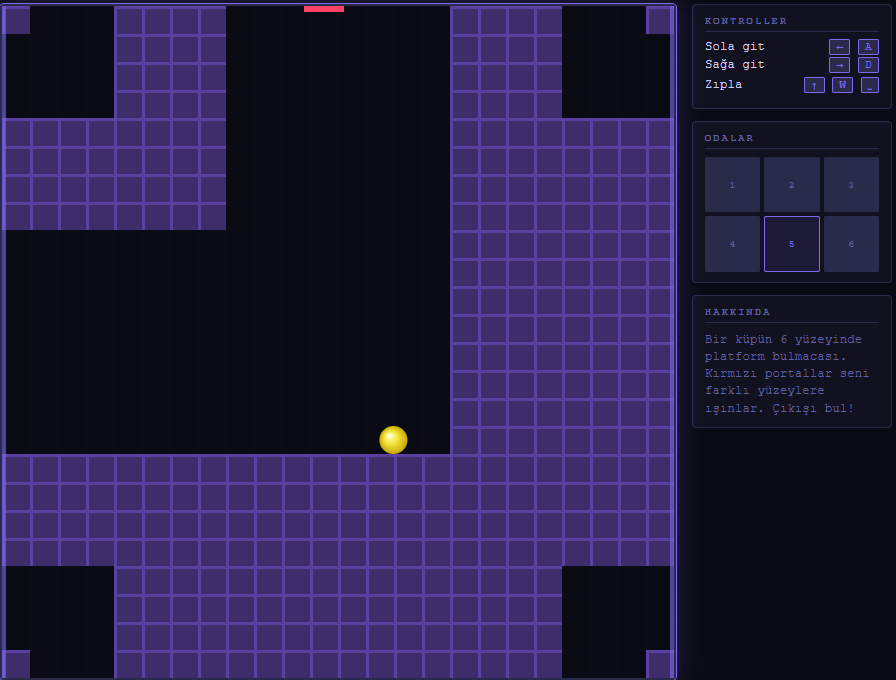
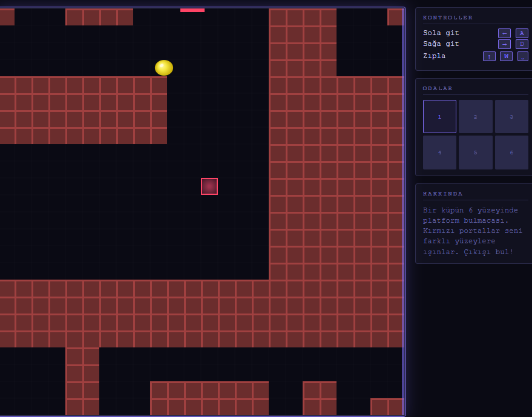
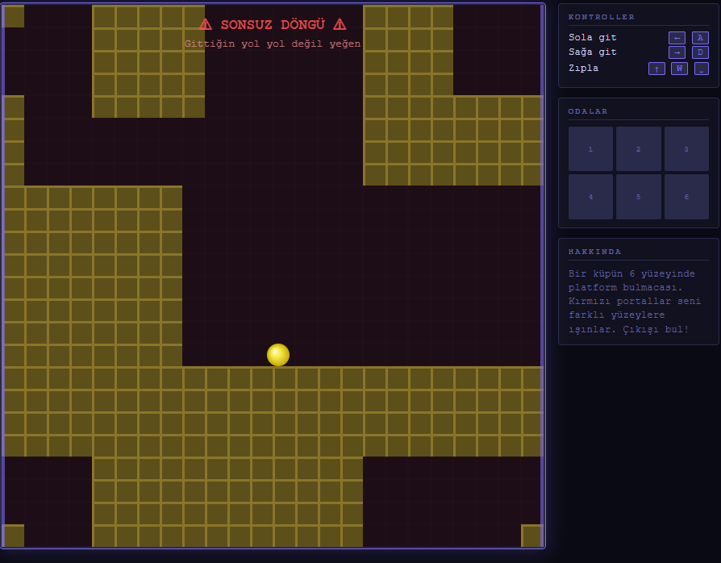
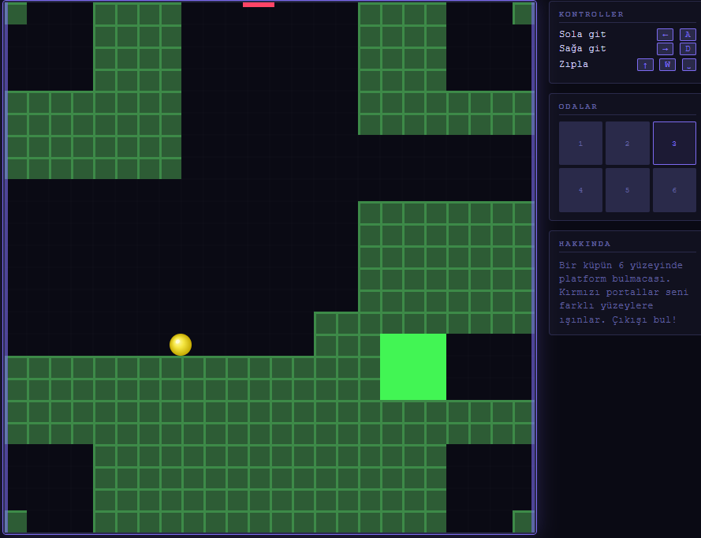
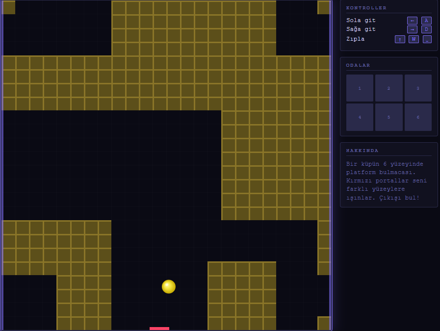

# Holomony








## Projenin Genel Özeti
Holomony, bir küpün farklı yüzeylerinde geçen uzamsal zekaya ve harita rotasyonlarına dayalı bir 2D platform bulmaca oyunudur. Karakterimiz odalar ve portallar arasında geçiş yaptıkça harita 90, 180 veya 270 derece dönüyor ve oyuncunun yön algısı sürekli test edilir ama daha kolay anlaşılması için renklendirilmiştir. Harita renkleri(kırmızı,mavi,yeşil,sarı,mor,turuncu) odaların açısal olarak farklı bile olsa aynı renkli temsil eder. Oyunda oyuncuyu sürekli 90 derece döndürerek sonsuz bir döngüye sokabilecek bazı durumları engellemek adına orijinal oyuna kıyasla özgürlükleri biraz kısıtladım; ancak gururla söyleyebilirim ki oyun %80 oranında orijinal mekaniklere sadık kalarak geliştirilmiştir.

## Oyundaki Hedef ve Zorluklar 
**Hedef:** Küpün karmaşık ve birbiriyle bağlantılı yüzeyleri (A, B ve C oda varyasyonları) arasında kaybolmadan ilerlemek doğru portalları ve boşlukları kullanarak en sonunda yeşil çıkış bloğuna ulaşmaktır.

**Zorluk:** Oyunun temel zorluğu uzamsal algı ve hafızadır. Bir odadan aşağı düştüğünüzde kendinizi başka bir odanın tavanından düşerken bulabilirsiniz. Harita geçişlerindeki rotasyonlar nedeniyle az önce tırmandığınız duvar, saniyeler sonra üzerinde yürüdüğünüz bir zemine dönüşür. Oyuncunun ezbere gitmek yerine hangi rengin hangi oda yönünü temsil ettiğini çözmesi, "Sonsuz Döngü" tuzaklarından (örneğin 3C odasındaki çıkmazlardan) kaçınması ve doğru güzergahı (oda1 -> oda1b -> oda1c... gibi) zihninde haritalandırması gerekmektedir.

## 🗺️ Oyunun Yol Haritası ve Tam Çözüm 

Oyunun karmaşık yerçekimi yapısı ve rotasyon döngüleri nedeniyle değerlendirme sürecini ve testleri kolaylaştırmak adına odalar arası geçiş güzergahları aşağıda dilim döndüğünce anlattım.

<details>
<summary><b>Harita Güzergahını Görmek İçin soldaki beyaz üçgene tıklayınız(Spoiler İçerir-önce düşünmeye çalışınız)</b></summary>

### 🟢 Ana Güzergah (A Odaları Döngüsü)
* **Oda1:** Oyuna matristeki '2' konumunda başlarız. Buradan **sola** giderek Oda 2'ye geçeriz.
* **Oda 2:** **Aşağı** doğru düşerek Oda3'e geçeriz.
* **Oda3:** **Sola** giderek Oda4'e ulaşırız.
* **Oda4:** İlerleyip **sol aşağı** doğru düştüğümüzde Oda5'teyiz.
* **Oda5:** **Sola** giderek Oda6'ya geçeriz.
* **Oda6:** Buradan **aşağı** düştüğümüzde başladığımız yere yani **Oda 1**'e geri dönerek ilk döngüyü tamamlıyoruz

### 🟡Alternatif Boyut(B Odaları Güzergahı)
Eğer Oda 1'de ana döngüye devam etmek yerine **sol üstteki** geçişe (matristeki '5' noktası) ulaşırsak, "B Odaları" adı verilen yeni bir boyuta geçeriz.
* **Oda1B:** Matristeki '6' konumunda başlarız. Alttaki zemine inip **sola** gittiğimizde Oda2B'ye geçeriz.
* **Oda2B:** Düz olarak **sağa** ilerleyip **aşağı** düştüğümüzde Oda3B'deyiz.
* **Oda3B:** **Sağa** doğru giderek Oda4B'ye ulaşırız.
* **Oda4B:** **Aşağı** inilir. *(Dikkat: Buradaki '8' ile işaretli bloklar birer tuzaktır dokunulduğunda bölümün başına atar).* Tuzakları aşıp aşağı indiğimizde Oda 5B'ye geçeriz.
* **Oda 5B (Yol Ayrımı):**
  * **Sağa gidilirse:** Oda6B'ye geçilir. Oradan da ilerleyip aşağı düşüldüğünde tekrar **Oda 1B**'ye dönülür(B Döngüsü).
  * **Aşağı gidilirse:** Hikayenin sonuna yaklaştığımız **C Odalarına** düşüş yapılır.

### 🔴Son Düzlük ve Çıkış(C Odaları Güzergahı)
Oda5B'den aşağı düştüğümüzde Oda1C'de (matristeki '11' noktası) kendimizi buluruz.
* **Oda1C:** Doğduğumuz an hemen solumuzda **ÇIKIŞ (Bitiş Noktası)** bulunur! Ancak diğer sol yoldan gidilirse aşağı düşülür ve oyun Oda 2C'den devam eder.
* **Oda 2C (Yol Ayrımı):**
  * **Sola gidilirse:** Oda 7C'ye geçilir. Oradan da başlangıç haritasındaki **Oda 2**'ye geri dönülür (İlerisi duvar oolduğu için).
  * **Sağa gidilirse:** Aşağı düşülür ve Oda3C'ye geçilir.
* **Oda 3C:** **Sağa** gidilerek Oda4C'ye geçilir.
* **Oda 4C:** **Sağ aşağı** düşülerek Oda5C'ye geçilir.
* **Oda 5C:** **Sola** gidilerek Oda6C'ye geçilir.
* **Oda 6C:** İlerleyip **aşağı** Oda7C'ye düşülür. Oda7C'den ise tekrar Oda2C'ye bağlanılarak **C Döngüsü** tamamlıyoruz ama kısır döngü.

### 🎨 Renk Kodlaması (Açısal Varyasyonlar)
Odalar aynı yapıya sahip olsa da farklı dönüş açılarına girdiklerinde renk değiştirerek sadece açısının değiştiğini belli etmeye çalıştık:
* **Kırmızı:** Oda1, Oda1B, Oda1C
* **Mavi:** Oda2, Oda6B, Oda7C,Oda5C
* **Yeşil:** Oda3, Oda5B, Oda2C
* **Sarı:** Oda4, Oda 4B, Oda3C
* **Mor:** Oda5, Oda3B, Oda4C
* **Turuncu:** Oda6, Oda2B, Oda6C

</details>

## Kontroller
Oyunu oynamak oldukça basittir:
* **Sola Gitmek İçin:** `Sol Ok Tuşu`veya`A`
* **Sağa Gitmek İçin:** `Sağ Ok Tuşu`veya`D`
* **Zıplamak İçin:** `Yukarı Ok Tuşu`, `W` veya `Boşluk(Space)`


## Başlangıç
Bu projeyi cihazınızda çalıştırmak veya doğrudan tarayıcı üzerinden oynamak için aşağıdaki adımları takip edebilirsiniz.

### Canlı Demo 
Oyunu bilgisayarınıza indirmeden, doğrudan tarayıcınız üzerinden oynamak için aşağıdaki bağlantıya tıklayabilirsiniz:
👉 **[https://arif-kemal.github.io/Holomony_itch.io/]**

### Yerel Kurulum(Gereksinimler ve Yükleme)
Proje tamamen istemci tarafında  çalışmaktadır. Herhangi bir sunucu veya paket yükleyicisine (npm, Node.js vb.) ihtiyacınız yoktur sadece düşünmeye ihtiyacınız var.
1. Projeyi bilgisayarınıza klonlayın:
   ```bash
   git clone [https://github.com/Arif-kemal/Holomony_itch.io.git](https://github.com/Arif-kemal/Holomony_itch.io.git)
2. İndirdiğiniz klasörün içine girin.
3. index.html dosyasını Chrome, Firefox veya Edge vb web tarayıcılarında açın.
4. Başlangıç ekranındaki "BAŞLA" butonuna tıklayarak matematiğin javascript halini oyanayabilirsiniz.

(Not: Müzik ve ses efektlerinin sorunsuz çalışması için muzik.mp3, gecis.mp3 ve hedef.mp3 dosyalarının index.html ile aynı dizinde bulunmasına dikkat edin.)

☺ Testler
Projenin fizik motoru (AABB çarpışma sistemi), matris dönüşleri ve yerçekimi mekanikleri geliştirme ortamında tarayıcı konsolu(F12)üzerinden manuel(tek tek tarandı örn: favicon.ico:1  Failed to load resource: the server responded with a status of 404 (Not Found),oyun.js:1 Uncaught SyntaxError: Identifier 'top' has already been declared (at oyun.js:1:1)) olarak test edilmiştir. Oyuncunun harita dışına çıkmasını engelleyen "kenar yaslama" algoritmaları ve zıplama animasyonları (squish) her bir oda geçişi için ayrı ayrı kontrol edilmiştir.

Kullanılan Teknolojiler 
HTML5 Canvas: Oyun alanının kare kare(60 FPS)çizilmesi için kullanıldı.

Vanilla JavaScript: Oyun döngüsü(requestAnimationFrame), AABB çarpışma fiziği, matris manipülasyonları ve çoklu oda rotasyon algoritmaları için kullanıldı.(Bazı hazır paketler incelendi özellikle orijinal oyundaki gadot ile yazılmış olan kodlar.)

CSS3: Oyunun uzay temalı minimalist arayüzü ve bilgi panelleri(HUD) için kullanıldı.

Geliştirme Süreci ve Karşılaşılan Zorluklar
Projeyi sıfırdan geliştirirken harita matrislerini istenen açılarda döndüren algoritmaları elimden gelen en iyi şekilde kodladım. Ancak orijinal oyundaki o kusursuz yerçekimi değişimini kendi yazdığım fizik motoruna tam anlamıyla entegre etme noktasında oldukça zorlandım. Matrisler döndüğünde karakterin momentumunu yeni zemine aktarmak ve serbest düşüş hissiyatını orijinali gibi kayıpsız yapmak için çok uğraşsam da bu fizik hesaplamalarında bazı tıkanıklıklar yaşadım. Bu nedenle oyunun o zihin yakan güzergahını ve harita mantığını tamamen koruyarak karakter fiziğini çalıştırabildiğim en stabil ve oynanabilir versiyona uyarlamak için matrix sayısını arttırdım.

Geliştirenler
Arif Kemal Şeremet-Geliştirme+kodlama(.js-canvas)+matematik
Musab Emir Öztop-geliştirme+kodlama(.js)+sunum
Hüseyin Koçak-kodlama(html)+sunum

Lisans
Bu proje MIT Lisansı altında lisanslanmıştır. Detaylar için LICENSE dosyasına göz atabilirsiniz.

Teşekkür ve Orijinal Eser
Bu proje, GMTK Jam 2022'de yayınlanan ve çok yaratıcı,fantastik hatta muazzam bulduğum Holonomy oyununun bir uyarlamasıdır.

Orijinal Oyun: Holonomy(itch.io)
orijinal oyun linki: https://itch.io/jam/gmtk-jam-2022/rate/1617160
Orijinal Kaynak Kodları: [Fuzzyzilla/Holonomy](https://github.com/Fuzzyzilla/Holonomy)(GitHub)
Orijinal geliştiriciye bu harika konsept(48 saatte bu kadar güzel,tamamlanmış ve analitik düşünme gerektiren) ve ilham için teşekkürler!


  
